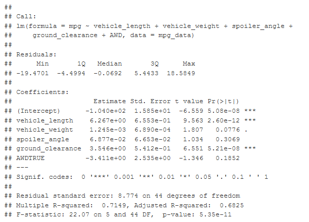
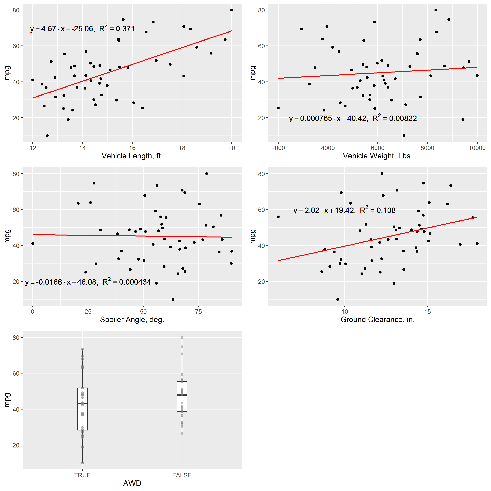

# Module 15 Challenge - AutosRUs MechaCar Statistical Analysis - Statistics and R

## Overview

Project Origination Date: 2021-09-13

### Purpose

The purpose of this project is to analyze production difficulties
of AutoRUs' newest prototype, the MechaCar.

Production data will be analyzed statistically to look for insights
that may help the manufacturing team to alleviate production difficulties.

### Tasks

1. Perform multiple linear regression analysis to identify which variables in the dataset predict the mpg of MechaCar prototypes.
2. Collect summary statistics on the pounds per square inch (PSI) of the suspension coils from the manufacturing lots.
3. Run t-tests to determine if the manufacturing lots are statistically different from the mean population.
4. Design a statistical study to compare vehicle performance of the MechaCar vehicles against vehicles from other manufacturers.
5. Write a summary interpretation for each statistical analysis (here, in this README.md)

### Approach

- Use R and RStudio for this internal analysis.

### Deliverables

1. Linear Regression to Predict MPG
2. Summary Statistics on Suspension Coils
3. T-Test on Suspension Coils
4. Design a Study Comparing the MechaCar to the Competition

### Resources

- Software:
	- R Version 4.1.1 (2021-08-10)
	- RStudio Version 1.4.1717
- Data:
	- `MechaCar_mpg.csv`
		- Internal data collection, provided by AutoRUs Management
		- Contains mpg test results for 50 prototype MechaCars (50 Records)
	- `Suspension_Coil.csv`
		- Internal data collection, provided by AutoRUs Management
		- Contains results from multiple production lots (150 Records)

Additional information about these resources is outlined below in Tables 1 & 2.

**Table 1: `MechaCar_mpg.csv` Fields**
| Field Name		| Brief Description of Contents |
|-----------------------|-------------------------------|
| `vehicle_length`      | Vehicle Length in US-Feet, ranging between 12 and 20. Decimal Feet to 8 Decimal Places.
| `vehicle_weight`      | Vehicle Weight in US-Pounds, ranging between 2,000 and 10,000. Decimal Pounds to 6 Decimal Places.
| `spoiler_angle`       | Spoiler Angle in Degrees, ranging between 0 and 90. Decimal Degrees to 8 Decimal Places.
| `ground_clearance`    | Ground Clearance in US-Inches, ranging between 6 and 18. Decimal Inches to 8 Decimal Places.
| `AWD`                 | "All-Wheel Drive" Boolean Qualifier. 1 means vehicle is All-Wheel Drive, 0 means vehicle is not All-Wheel Drive.
| `mpg`                 | Fuel Efficiency measured in US-Miles-per-US-Gallon, ranging between 10 and 80. Decimal mpg to 8 Decimal Places.

**Table 2: `Suspension_Coil.csv` Fields**
| Field Name		| Brief Description of Contents |
|-----------------------|-------------------------------|
| `VehicleID`           | Alphanumeric Vehicle Identification Number. All values start with "V" followed by a 3-5 digit numeric sequence ranging between 213 and 49,408. 149 unique VehicleIDs among 150 records (V40607 is present twice, once with a record for Lot1, and once with a record for Lot2)
| `Manufacturing_Lot`   | Alphanumeric Lot Number of Record. All values in the form of "LotN", with N being a single-digit integer, ranging between 1 and 3.
| `PSI`                 | weight capability in US-Pounds-per-square-US-inch of suspension coils. Integer PSI values, ranging between 1,452 psi to 1,542 psi.

#### Data Quality

The data provided in both files appears to be consistent and reliable. All records correspond to the appropriate fields, measurements are presented with consistent units and fall within expected ranges, and there are no NULL values.

## Deliverables

### Deliverable 1

#### Linear Regression to Predict MPG

After the `MechaCar_mpg.csv` data was imported into R, a Multiple Linear Regression was performed
using all of the other measured quantities in the dataset to see which, if any, independent variables had an impact on the Miles-per-Gallon (mpg) of the MechaCar.

The summary output from this Multiple Linear Regression is shown here:

As an aid in interpretation, simplified Univariate Linear Regressions were also performed on the 4 Independent Variables with Continuous Measures (`vehicle_length`, `vehicle_weight`, `spoiler_angle`, and `ground_clearance`),
and a pair of boxplots was generated for the `AWD` which is a Boolean Independent Variable. Since Multiple Linear Regressions are difficult if not impossible to visualize, these simplified models will be useful to refer back
to when interpreting the results from the Multiple Linear Regression above.

Plots of these linear regressions are shown here in Figure 1, reproduced as a Gallery in Miniature.

(Full-Size Versions are Archived in `Images` Directory of this GitHub Repository)

**Figure 1: Linear Regressions and Boxplots for Independent Variables in `MechaCar_mpg.csv`**

- Q: Which variables/coefficients provided a non-random amount of variance to the mpg values in the dataset?
	- A: For this project, we are starting with a baseline p-Value Significance Level of 0.05. With this in mind, looking at the summary output of the Multiple Linear Regression,
	`vehicle_length` and `ground_clearance` provide a non-random amount of variance to the mpg values. `vehicle_weight` also has a level of non-random contribution, but it is slightly
	above our 0.05 cutoff. This interpretation is backed up by consulting our series of Univariate Linear Regressions, where Vehicle Length and Ground Clearance both show positive
	correlation to mpg, with the highest Coefficient of Determination (r-squared) values among the variables modeled.

- Q: Is the slope of the linear model considered to be zero? Why or why not?
	- A: No, the slope of the linear model is not considered to be zero. This is because the two values that provide a non-random amount of variance to the mpg values
	have non-zero slopes for their regression equations.

- Q: Does this linear model predict mpg of MechaCar prototypes effectively? Why or why not?
	- A: Yes, this linear model effectively predicts the mpg of MechaCar prototypes. With a Combined Coefficient of Determination of 0.7, this shows that 70% of the variation of mpg values
	can be attributed to the 5 variables modeled against mpg. This result is better than chance, and would be a good starting point for helping to guide engineering decisions for
	future prototypes, if maximizing mpg was a stated design outcome.

### Deliverable 2

Lorem ipsum dolor sit amet, consectetur adipiscing elit. Proin aliquet iaculis lorem non sollicitudin. Fusce elementum ac elit finibus auctor. Curabitur orci sem, accumsan a diam sit amet, efficitur tristique velit.

### Deliverable 3

Lorem ipsum dolor sit amet, consectetur adipiscing elit. Proin aliquet iaculis lorem non sollicitudin. Fusce elementum ac elit finibus auctor. Curabitur orci sem, accumsan a diam sit amet, efficitur tristique velit.

### Deliverable 4

Lorem ipsum dolor sit amet, consectetur adipiscing elit. Proin aliquet iaculis lorem non sollicitudin. Fusce elementum ac elit finibus auctor. Curabitur orci sem, accumsan a diam sit amet, efficitur tristique velit.

-- END --
